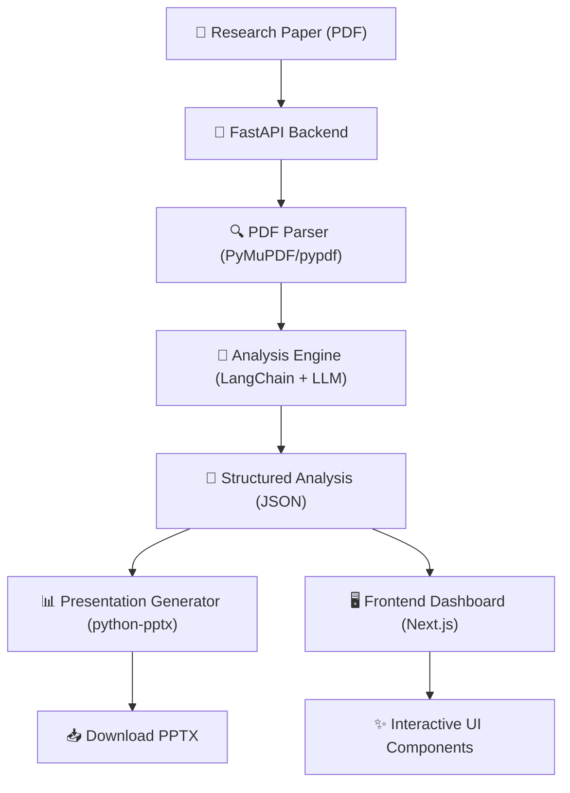

# 🔬 Autonomous Research Paper Analyzer

An advanced, AI-powered system designed to automate the process of analyzing research papers. It handles everything from PDF text extraction and semantic analysis to generating professional presentation summaries.

## 🌟 Key Features

-   **Intelligent PDF Extraction**: Uses `PyMuPDF` and `pypdf` to accurately parse text, sections, and even complex mathematical equations from PDF documents.
-   **AI-Driven Semantic Analysis**: Leverages state-of-the-art LLMs (GPT-4 or Gemini Pro) via `LangChain` to provide PhD-level summarization, extraction of core contributions, and identification of research limitations.
-   **Equation Intelligence**: Automatically detects LaTeX equations and provides simplified, natural-language explanations.
-   **Automated Presentation Generation**: Transforms analyzed data into a high-quality, professional `.pptx` presentation summary, saving hours of manual work.
-   **Cinematic Cyprus & Sand UI**: A world-class, production-ready dashboard using a luxury color palette (`#004643` & `#F0EDE5`) with cinematic motion, parallax backgrounds, and liquid interactive buttons.

## 🏗️ System Architecture



## 🛠️ Technology Stack

### **Backend**
-   **Framework**: FastAPI
-   **LLM Orchestration**: LangChain
-   **PDF Processing**: PyMuPDF, pypdf
-   **Analysis Models**: OpenAI GPT-4 / Google Gemini Pro
-   **Data Validation**: Pydantic
-   **Database**: PostgreSQL with SQLAlchemy ORM

### **Frontend**
-   **Framework**: Next.js 14 (App Router)
-   **Styling**: Tailwind CSS
-   **Animations**: Framer Motion
-   **Icons**: Lucide React
-   **Language**: TypeScript

## 🚀 Getting Started

### Prerequisites
- Python 3.9+
- Node.js 18+
- PostgreSQL (database)
- API Keys for OpenAI or Google Gemini

### Backend Setup
1.  Navigate to the backend directory:
    ```bash
    cd backend
    ```
2.  Create and activate a virtual environment:
    ```bash
    python -m venv venv
    # Windows:
    venv\Scripts\activate
    # macOS/Linux:
    source venv/bin/activate
    ```
3.  Install dependencies:
    ```bash
    pip install -r requirements.txt
    ```
4.  Configure environment variables:
    -   Copy `.env.example` to `.env`.
    -   Fill in `OPENAI_API_KEY`, `GOOGLE_API_KEY`, and `DATABASE_URL`.
5.  Run the development server:
    ```bash
    uvicorn main:app --reload
    ```

### Frontend Setup
1.  Navigate to the frontend directory:
    ```bash
    cd frontend
    ```
2.  Install dependencies:
    ```bash
    npm install
    ```
3.  Run the development server:
    ```bash
    npm run dev
    ```

## 📦 Deployment

### **Frontend (Vercel)**
1.  Connect your GitHub repository to [Vercel](https://vercel.com).
2.  Set the **Root Directory** to `frontend`.
3.  Add the environment variable `NEXT_PUBLIC_API_URL` pointing to your deployed FastAPI backend.
4.  Vercel will automatically detect the Next.js preset and deploy.

### **Backend (Render / Railway / Fly.io)**
FastAPI requires a Python-capable host.
1.  Connect the same repo to Render/Railway.
2.  Set the **Build Command** to `pip install -r backend/requirements.txt`.
3.  Set the **Start Command** to `cd backend && uvicorn main:app --host 0.0.0.0 --port $PORT`.

### **Standard Docker Deployment**
1.  Standardize your `.env` files in both directories.
2.  Run the entire stack from the root directory:
    ```bash
    docker-compose up --build
    ```

## 🔌 API Endpoints

| Method | Endpoint | Description |
| :--- | :--- | :--- |
| `POST` | `/upload` | Upload a PDF file for full analysis and PPTX generation. |
| `GET` | `/download/{filename}` | Download the generated PPTX or other analysis assets. |
| `GET` | `/` | API health check and welcome message. |

## 📁 Project Structure

```text
.
├── backend/
│   ├── app/                # Core logic (parser, analysis, generator)
│   ├── main.py             # FastAPI entry point
│   └── requirements.txt    # Python dependencies
├── frontend/
│   ├── src/
│   │   ├── app/            # Next.js App Router pages
│   │   └── components/     # UI components
│   └── package.json        # Node.js dependencies
└── docker-compose.yml      # Orchestration for Docker containers
```
